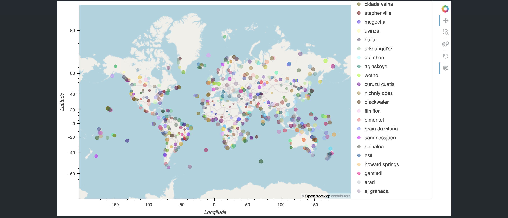

# World Weather Analysis 

## Description
Analysis of worldwide weather patterns related to latitude.

## Table of Contents
- [Installation](#installation)
- [Usage](#usage)
- [Credits](#credits)
- [License](#license)
- [Features](#features)

- [Contact](#contact)

## Installation
python, requests, hvplot, pandas

## Usage
Run weather.py file and vacation.py file with python 

## Credits
Catherine 

## License
MIT

## Features
It provides information about temperature based on latitude

## Contact
If there are any questions of concerns, I can be reached at:
##### [github: mattcat1221](https://github.com/mattcat1221)
##### [email: caseyvmatthews@gmail.com](mailto:caseyvmatthews@gmail.com)
